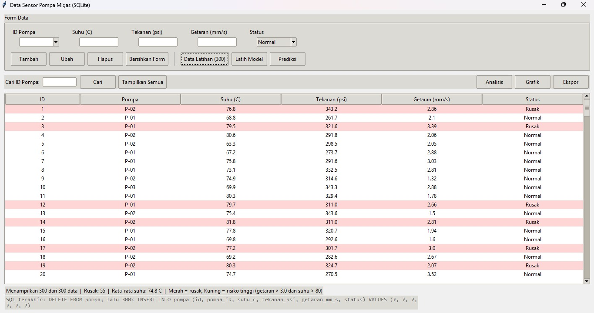

# Aplikasi Monitoring Sensor Pompa Migas



Aplikasi desktop (Python) untuk ...


Aplikasi desktop (Python) untuk mengelola data sensor pompa, menganalisisnya,
dan memprediksi apakah sebuah pompa berisiko rusak menggunakan machine learning.
Dibuat sebagai proyek belajar Data Science, dengan studi kasus industri minyak dan gas.

## Fitur

- **CRUD data sensor** (tambah, ubah, hapus, cari) dengan database SQLite
- **GUI** berbasis tkinter dan **mode terminal**
- **Pengurutan** data dengan klik judul kolom, dan **pewarnaan baris** (merah = rusak, kuning = risiko tinggi)
- **Analisis data**: statistik deskriptif, rata-rata per pompa, grafik boxplot
- **Machine learning**: model Random Forest untuk memprediksi status pompa (Normal / Rusak) beserta peluangnya
- **Ekspor** data ke Excel / CSV
- Panel **"SQL terakhir"** yang menampilkan perintah SQL di balik setiap aksi

## Teknologi

Python, SQLite, pandas, NumPy, scikit-learn, matplotlib, tkinter

## Cara Menjalankan

```bash
git clone https://github.com/AbiRafi31/monitoring-pompa-migas.git
cd monitoring-pompa-migas
pip install -r requirements.txt
python main.py
```

Pilih `2` untuk mode GUI. Klik **Data Latihan (300)** untuk mengisi data simulasi,
lalu **Latih Model** dan **Prediksi**.

## Struktur Proyek

```
main.py            # aplikasi utama (database, CRUD, ML, GUI, mode terminal)
latihan_sql.py     # latihan query SQL pada salinan data
requirements.txt   # daftar library
```

## Hal yang Dipelajari

- Membersihkan dan menganalisis data dengan pandas
- Operasi SQL (SELECT, INSERT, UPDATE, DELETE, ORDER BY, LIKE) dengan query berparameter
  untuk mencegah SQL injection, serta constraint dan transaksi pada SQLite
- Pipeline machine learning: train/test split, evaluasi (akurasi, precision, recall),
  dan feature importance
- Membuat antarmuka GUI dengan tkinter

## Catatan

- Seluruh data adalah **data simulasi** untuk keperluan belajar, bukan data operasional sungguhan.
- Pada data latihan, status "Rusak" jauh lebih sedikit daripada "Normal" (data tidak seimbang).
  Akibatnya, akurasi terlihat tinggi tetapi recall untuk kelas "Rusak" masih rendah.
  Perbaikan yang direncanakan: `class_weight="balanced"` dan data sensor sungguhan.

## Rencana Pengembangan

- [ ] Menangani data tidak seimbang dan membandingkan beberapa model
- [ ] Mencoba dataset terbuka NASA C-MAPSS (predictive maintenance)
- [ ] Dashboard visualisasi (Power BI / Tableau)